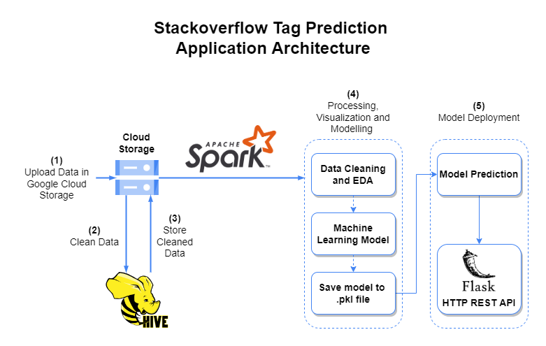

# Cloud-Technologies-Assignment-2-Stackoveflow-Tag-Prediction

# Relevant Files

- > **Queries Used.txt** - Hive Queries used for Cleaning the Data

- > **1_data-processing** - Data Processing Using PySpark

- > **2_eda-modelling** - Contains code for Exploratory Data Analysis

- > **model_building_v2** - Script contains modelling and performace of the model used

# Application Architecture

 

 # Screenshots

# Confusion Matrix for Predictions

